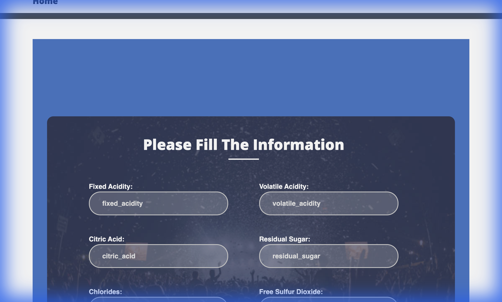

# 🍷 End-to-End Machine Learning Project: Wine Quality Prediction

[](https://www.python.org/)
[](https://flask.palletsprojects.com/)
[](https://scikit-learn.org/)
[](LICENSE)

## 📌 Project Overview

This project is a complete **End-to-End Machine Learning Pipeline** designed to predict the quality of red wine based on various physicochemical properties. It demonstrates best practices in MLOps, from data ingestion and validation to model training and deployment via a web application.

The application allows users to input wine characteristics through a user-friendly interface and receive an instant quality prediction.



## ✨ Key Features

- **Modular Pipeline**: Organized into 5 distinct stages (Ingestion, Validation, Transformation, Training, Evaluation) for scalability and maintainability.
- **Data Validation**: Robust schema checks using `schema.yaml` to ensure data integrity.
- **Experiment Tracking**: Detailed logging and artifacts generation for every run.
- **Web Interface**: A clean, responsive Flask-based web application for real-time predictions.
- **Model**: Utilizes ElasticNet Regression for accurate quality estimation.

## 🛠️ Tech Stack

- **Language**: Python 3.8
- **Framework**: Flask
- **Libraries**: Pandas, Scikit-learn, NumPy, Matplotlib, Joblib, Box
- **Configuration**: YAML based configuration management
- **Frontend**: HTML5, CSS3, Bootstrap

## 📂 Project Structure

```bash
├── artifacts/          # Generated artifacts (models, data)
├── config/             # Configuration files
├── research/           # Jupyter notebooks for experimentation
├── src/
│   └── mlProject/      # Core package source code
│       ├── components/ # Logic for each pipeline stage
│       ├── pipeline/   # Pipeline orchestration
│       └── entity/     # Data classes
├── static/             # CSS, JS, and Images for the web app
├── templates/          # HTML templates
├── app.py              # Flask application entry point
├── main.py             # Main pipeline entry point
└── params.yaml         # Model hyperparameters
```

## 🚀 Getting Started

Follow these steps to set up the project locally.

### Prerequisites

- Python 3.8+
- Anaconda / Miniconda (recommended)

### Installation

1.  **Clone the Repository**
    ```bash
    git clone https://github.com/shaurya-aggarwal44/End-to-end-Machine-Learning-Project
    cd End-to-End-Machine-Learning-Project
    ```

2.  **Create a Virtual Environment**
    ```bash
    conda create -n mlproj python=3.8 -y
    conda activate mlproj
    ```

3.  **Install Dependencies**
    ```bash
    pip install -r requirements.txt
    ```

### Usage

1.  **Run the Training Pipeline**
    To train the model from scratch:
    ```bash
    python main.py
    ```

2.  **Start the Web Application**
    ```bash
    python app.py
    ```

3.  **Access the App**
    Open your browser and navigate to: [http://localhost:8080](http://localhost:8080)

## 🔄 Development Workflows

The project follows a structured workflow for adding new components:

1.  Update `config.yaml`
2.  Update `schema.yaml`
3.  Update `params.yaml`
4.  Update the Entity
5.  Update the Configuration Manager
6.  Update the Components
7.  Update the Pipeline
8.  Update `main.py`
9.  Update `app.py`

## 👨‍💻 Author

**Shaurya Aggarwal**
---
*Built with ❤️ by Shaurya Aggarwal*
